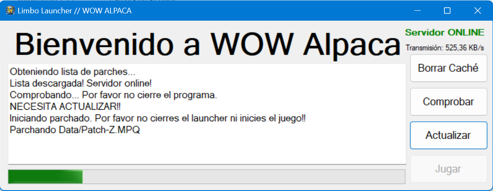
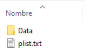
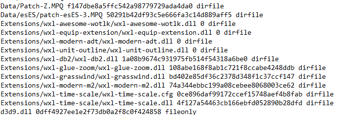

# Custom World of Warcraft Launcher
Launcher custom codificado basado en WOWLauncher.
He borrado todos los archivos, reemplazándolos por un comprimido.

### Características
* Descarga cualquier archivo y crea nuevos archivos si existen en el host pero no en la carpeta del wow.
* IMPORTANTE: se crea la carpeta Patch-Y.MPQ para guardar archivos individuales, necesario para actualizar algunos servidores
* Interfaz simple simple, archivo ligero.

### Requerimientos
* Windows 10 o superior.

#### Para desarrolladores
* Visual Studio 2022 Community
* uso: cambiar las siguientes líneas en el archivo Form1.cs con tus propios datos:
> 23: la URL completa de tu archivo plist.txt 
> 24: la dirección URL raíz de tus parches 
> 25: la dirección de tu servidor, sin HTTP ni parámetros adicionales
* Compilar y distribuir

* Archivo plist:
> DirectorioRelativo/NombreDeArchivoConExtensión HashMD5
* No se requiere de modificaciones adicionales, al menos que cambie el código para actualizar realmlist o alguna característica adicional.

#### Para usuarios
* .NET Desktop Runtime 6.0+
* En algunos casos, desactivar el antivirus. Pueden revisar el código fuente para comprobar que el programa hace lo que hace y no otra cosa.

### Imágenes
 
El launcher en acción

 
Directorio donde se encuentra la publicación del patchlist

 
Contenido de ejemplo del archivo PLIST.TXT

### Licencia
Si bien no se menciona ninguna marca comercial,
Todas las marcas comerciales pertenecen a sus respectivos dueños.
